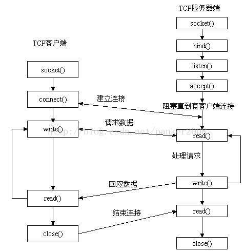
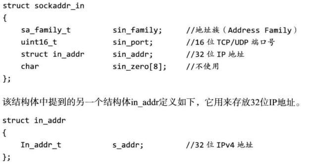

# Socket编程
## 一、socket概念
### 1、socket概念
socket是一种特殊的IO接口，也是一种文件描述符。网络中用于计算机程序与其他计算机程序之间的通讯方式。<br>
socket也称为套接字，用于描述IP地址和端口，是一个通讯链路的句柄。应用程序通过socket向网络发出请求或者接收请求。<br>
socket是两个终端双向通信的端点，通讯两端都有socket，数据在两个socket之间传输。 <br>
### 2、套接字（socket）
TCP提供的两种通讯机制：流stream和数据包datagram，所以套接字的类型也分为流套接字和数据报套接字。数据报套接字的应用场景较少。<br>
1）流套接字：SOCK_STREAM指定，SOCK_STREAM是表示面向连接的数据传输方式。提供有序、可靠、双向字节流连接。<br>
2）数据报套接字：SOCK_DGRAM指定，SOCK_DGRAM是表示无连接的数据传输方式。不需要建立维持一个连接，UDP/IP协议实现。发送长度有限。UDP协议是不可靠的，但是速度快。<br>
## 二、socket通讯过程

### 1、使用函数
头文件：
```c++
#include<sys/typed.h>
#include<sys/socket.h>
```
#### 1）socket()函数创建套接字
函数功能：创建套接字。（socket创建的是一个主动套接字）<br>
函数声明：
```c++
int socket(int af, int type, int protocol);
```
>af ：协议域/协议族（Address Family），常用的有 AF_INET 和 AF_INET6。<br>
>>AF 是“Address Family”的简写，INET是“Inetnet”的简写；<br>
>>AF_INET 表示 IPv4 地址；<br>
>>AF_INET6 表示 IPv6 地址。<br>
>>一般填 AF_INET。<br>

>type：指定套接字类型，常用的有 SOCK_STREAM 和 SOCK_DGRAM。<br>
>>SOCK_STREA：流套接字；<br>
>>SOCK_DGRAM：数据报套接字。<br>
>>一般填SOCK_STREA流套接字。<br>

>protocol：表示传输协议，常用的有 IPPROTO_TCP 和 IPPTOTO_UDP。<br>
>>IPPROTO_TCP：TCP 传输协议；<br>
>>IPPTOTO_UDP：UDP 传输协议。<br>
>>一般填入0；<br>

返回值：成功，返回一个小的非负整数值；失败，返回负值。<br>

struct sockaddr_in这个结构体用来处理网络通信的地址，头文件:
```c++
#include<arpa/inet.h>。<br>
```
struct sockaddr_in结构体：<br>

关于地址的指定：<br>
>任意IP地址serv_addr.sin_addr.s_addr = htonl(INADDR_ANY);<br>
>指定IP地址serv_addr.sin_addr.s_addr =inet_addr("IP");<br>

#### 2）connect()建立连接（客户端使用）
函数功能：向服务器发起连接请求。<br>
函数声明：
```c++
int connect(int sockfd, const struct sockaddr *servaddr, socklen_t addrlen);
```
>将sockfd的socket连接到 servaddr指定的服务器，addrlen为sockaddr 的结构长度。<br>

返回值：成功返回0，失败返回-1。<br>

出现错误：服务端的地址错了，端口错了，服务器没有启动。<br>
#### 3）bind()绑定地址（服务端使用）
函数功能：服务端把用于通讯的地址和端口绑定到socket上。<br>
函数声明：
```c++
int bind(int sockfd, struct sockaddr *servaddr, socklen_t addrlen); 
```
>sockfd：需要绑定的socket；<br>
>servaddr：存放服务端绑定的地址和端口；<br>
>addrlen：servaddr结构体的大小。<br>

返回值：成功返回0，失败返回-1。<br>

出现错误：绑定的地址错误，端口被占用。<br>
#### 4）listen()监听（服务端使用）
函数功能：listen函数将主动套接字接口变为被动套接字接口，使这个socket可以接受去他啊socket的连接请求，从而成为一个服务端的socket。 socket必须要被bind才可以listen。<br>
函数声明：
```c++
	int listen(int sockfd, int backlog);
```
>sockfd：需要转换的套接字；<br>
>backlog 为请求队列的最大长度。<br>

>请求队列<br>
当套接字正在处理客户端请求时，如果有新的请求进来，套接字是没法处理的，只能把它放进缓冲区，待当前请求处理完毕后，再从缓冲区中读取出来处理。如果不断有新的请求进来，它们就按照先后顺序在缓冲区中排队，直到缓冲区满。这个缓冲区，就称为请求队列（Request Queue）。<br>
>缓冲区的长度<br>
缓冲区的长度（能存放多少个客户端请求）可以通过 listen() 函数的 backlog 参数指定，但究竟为多少并没有什么标准，可以根据你的需求来定。若果backlog=SOMAXCONN，就由系统来决定请求队列长度。<br>

返回值：成功返回0，失败返回-1。<br>
#### 5）accept()接受请求（服务端使用）
函数功能：服务端接受客户端的连接请求。<br>
函数声明：
```c++
int accept(int sockfd, struct sockaddr *cliaddr, socklen_t *addrlen); 
```
>sockfd：被listen的套接字；<br>
>cliaddr：存放客户端的地址信息；<br>
>addrlen：servaddr结构体的大小。<br>

accept等待客户端连接，如果没有客户端连接，就一直等待，这种方式称为阻塞。<br>
accept等到客户端连接后，创建一个新的套接字，函数返回值就是这个新的套接字，服务器使用这个新的套接字和客户端进行报文的收发。<br>

返回值：成功返回一个新的套接字；失败返回-1。<br>
#### 6）send()发送
函数功能：通过socket发送数据。<br>
函数声明：
```c++
size_t write(int sockfd, const void *buf, size_t nbytes);
```
>sockfd：已经建立好的的用于发送数据的socket；<br>
>buf：用于存放发送数据的内存地址；<br>
>len：发送数据长度，buf中有效数据的长度。<br>
>flag：一般为0；<br>

返回值：成功返回发送的数据；失败返回-1。<br>

发送的数据过大，可以循环调用send直至接收完毕。<br>
#### 7）recv()接收
函数功能：通过socket接收数据。<br>
函数声明：
```c++
size_t recv(int sockfd,  void* buf, size_t len,  int flag);
```
>sockfd：已经建立好的的用于接收数据的socket；<br>
>buf：用于存放接收数据的内存地址；<br>
>len：接收数据长度，不超过buf大小，否则会内存溢出。<br>

返回值：成功返回接收的数据；失败返回-1；socket被对端关闭返回0。<br>
>返回值<=0，表示通讯链路已不可用。<br>

接收的数据过大，可以循环调用recv直至接收完毕。<br>
#### 8）close()关闭
头文件：
```c++
#include <unistd.h>
```
函数功能：关闭套接字；<br>
函数声明：
```c++
close(int sockfd);
```
### 2、服务/客户端函数调用流程
服务端函数调用流程：socket->bind->listen->accept->recv/send->close<br>
客户端函数调用流程：socket->connect->send/recv->close<br>

## 三、网络字节与主机字节顺序
### 1、字节顺序
网络字节顺序（NBO，Network Byte Order）：<br>
按从高到低的顺序存储，在网络上使用统一的网络字节顺序，可以避免兼容性问题。<br>
主机字节顺序（HBO，Host Byte Order）：<br>
不同的机器HBO不相同，与CPU设计有关。<br>
### 2、大端小端
不同的计算机结构有时使用不同的字节顺序存储数据。<br>
例如，基于Intel的计算机存储数据的顺序与Macintosh(Motorola)计算机就是相反的。<br>

Intel字节顺序称为“Little-Endian”（小端）。<br>
网络上采用标准是“Big-Endian”（大端）。<br>

| | |
| ---- | ---- |
| Big-Endian（大端）   | 一个Word中的高位的Byte放在内存中这个Word区域的低地址处。|
| Little-Endian（小端）| 一个Word中的低位的Byte放在内存中这个Word区域的低地址处。|

详细解释：<br>
不同的CPU有不同的字节序类型，这些字节序是指整数在内存中保存的顺序，这个叫做主机序（主机字节顺序）。<br>

| | |
| ---- | ---- |
| Big-Endian（大端）    | 将高序字节存储在起始地址。 |
| Little-Endian（小端） | 将低序字节存储在起始地址。 |


| 函数 | 功能 |
| ---- | ---- |
| htons() | 把unsigned short类型从主机序转换到网络序。 |
| htonl() | 把unsigned long类型从主机序转换到网络序。  |
| ntohs() | 把unsigned short类型从网络序转换到主机序。 |
| ntohl() | 把unsigned long类型从网络序转换到主机序。  |

## 四、相关函数
### 1、exit()函数：
头文件
```c++
#include<stdlib.h>
```
函数功能：关闭所有文件，终止正在执行的进程。
```c++
exit(1); //表示异常退出.这个1是返回给操作系统的。
exit(0); //表示正常退出。
exit(x); //（x不为0）都表示异常退出。
```
### 2、名字地址转换
#### 1）gethostbyname()函数
函数功能：用域名或者主机名获取地址，操作系统提供的库函数。<br>
函数声明：
```c++
struct hostent *gethostbyname(const char *name);
hostent结构体：
	struct hostent {
	      char  *h_name;            /* official name of host（主机的规范名）*/
	      char **h_aliases;         /* alias list（主机的别名）*/
	      int    h_addrtype;        /* host address type（主机ip地址的类型）*/
	      int    h_length;          /* length of address（主机ip地址的长度）*/
	      char **h_addr_list;       /* list of addresses（主机的ip地址）*/
	}
```
返回值：成功，返回非空指针指向的hostent结构；失败，返回NULL指针。<br>
#### 2）gethostbyaddr()函数<br>
函数功能：用用地址获取主机名或域名，操作系统提供的库函数。<br>
函数声明：
```c++
struct hostent *gethostbyaddr(const char *addr, size_t len, int family);
```
返回值：成功，返回非空指针指向的hostent结构；失败，返回NULL指针。<br>
### 3、地址格式
inet_ntoa()函数<br>
函数功能：将网络地址转换成“.”点隔的字符串格式。<br>
函数声明：
```c++
char *inet_ntoa (struct in_addr);
```
